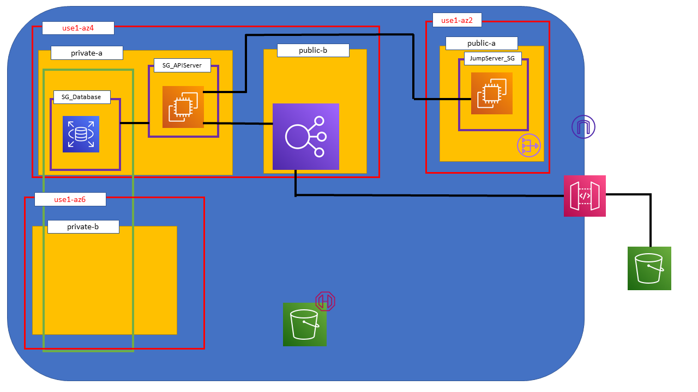
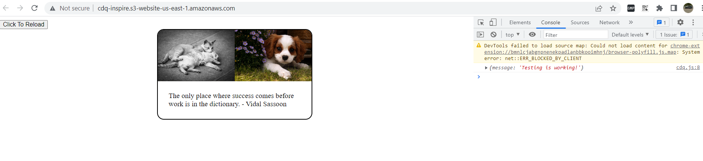
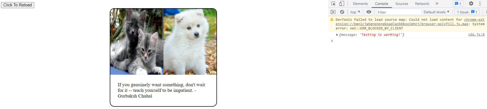

# Cat-Dog-Quote

You ever had money to burn and decided to give it to Amazon Web Services?

Yeah me neither.

But here's a simple project I made to familiarize myself with deploying Django on AWS. It is deployed inside a VPC, using EC2, S3, RDS and the API Gateway. 

It has two primary components: a simple API with two endpoints, and a frontend application using AJAX (no frameworks) to consume the API.

## Consuming The API

The API endpoints for the cdqapi app are:

- `/inspire`

Takes GET requests with no parameters to return a JSON response containing the following data:

timestamp - The timestamp that the server generated the response at
quote - The randomly picked quote from the quote database
cat_pic - The URL of the cat picture
dog_pic - The URL of the dog picture

- `/test`

Accepts a GET request to return the following:

`{
    message: "Testing is working!"
}`

## Data Dependencies

I have defined a single model in the API app, called Quote, which stores the quote text and quote author. I have a file called quotes.txt which contains all the quotes separated by newlines, and a function in cdqapi.tools called populate_quotes() which reads this file to generate the quote database.

The database is populated by going to your Django project folder and running the following commands:

`python manage.py shell`  
`import cdqapi.tools`  
`cdqapi.tools.populate_quotes()`

Don't forget to migrate your database first to create the tables.

For dev builds, the default database is SQLite, but for production builds, I set it to MySQL/MariaDB - it should be easy enough to change to Postgres if you want to.

The dog pic is randomly selected from a S3 bucket I own, and the cat pic is retrieved from The Cat API (https://thecatapi.com/).

## Application Structure

I deployed this application in a VPC in the us-east-1 region. My VPC has 4 subnets, 2 public and 2 private.

Private subnet A contains the API server as well as my single (non-redundant) MySQL RDS instance. The route table links to the NAT gateway in public subnet A to allow only connections to the internet originating from inside the subnet.

The RDS instance has its own security group called SG_Database, and the rules limit incoming and outgoing connections so that they are only valid from and to SG_APIServer security group.

The SG_APIServer security group contains my single API Server. The rules make it inacessible via the internet. It will only accept connections originating from resources in the JumpServer_SG or SG_Database or requests made through the network load balancer which resides in public subnet B.

> This was a big point of contention for me - I didn't realize that my network load balancer had to be in a public subnet in the same availability zone as the resource I wanted it to balance. This took a few hours of banging my head against my desk with some StackOverflow browsing.

Private subnet B is empty, but exists in a different availablity zone from private subnet A to facilitate the creation of a DB subnet group (the green box) for my RDS instance.

Public subnet A contains my jump server which is in the JumpServer_SG security group. This security group allows connections from the internet, but only via SSH, and allows back and forth communication with my API server inside SG_APIServer security group. If I had a company with an office, I could probably have secured it a bit more by only allowing ssh from IP addresses within my company's static IP range.

The API gateway connects to a network load balancer via a VPC link (couldn't find the icon) to allow access to the API via the internet. I kept it simple here and only added some throttling - no API key authentication or other fancy features. 

There are two S3 buckets in my application's architecture:

- The S3 bucket outside the VPC is used as a static site host, with some javascript that makes the fetch calls to the API to show the data on the web-page. If you choose to deploy this app yourself, remember to change the fetch URL.

- The S3 bucket inside the VPC is the one where my dog pictures are stored. It has a gateway endpoint attached so that data transferred can stay inside the VPC, instead of having to go over the internet, which should be faster (is it cheaper too?). 

The bucket security policy for the internal is set to block all public access, and instead, presigned URLs pointing to the resources in the bucket are created via code in my web app.

## API Server Deployment Details

The API server runs nginx and uwsgi with the Django module files. I create a shell script called setupserver.sh in the profile.d folder that sets the environment variables needed by the app every time the server reboots.

## The Result

Thanks for reading!
